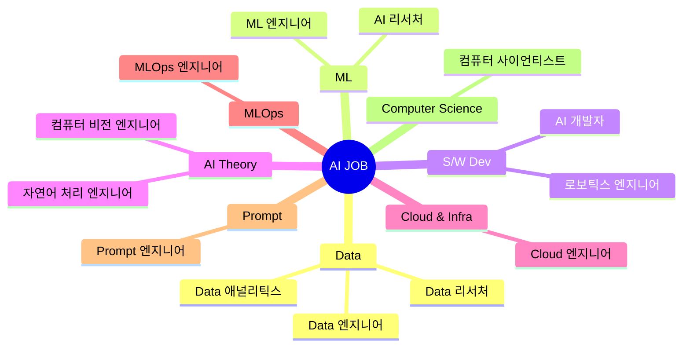

# MLOPs-AutoML

## mindmap

## AI 관련 직종 및 전문 영역

### 1. 데이터
- **데이터 애널리틱스**
    - 업무: 데이터 수집, 정제, 분석 및 시각화; 비즈니스 인사이트 제공
    - 기술 스택: SQL, Python, R, Tableau, Power BI, Excel
- **데이터 리서처**
    - 업무: 데이터 기반의 연구, 통계적 분석, 실험 설계 및 평가
    - 기술 스택: Python, R, 통계적 분석 방법, 실험 디자인, 머신 러닝
- **데이터 엔지니어**
    - 업무: 데이터 파이프라인 구축 및 관리, 대규모 데이터 저장 및 처리
    - 기술 스택: SQL, Python, Java, Apache Spark, Hadoop, ETL 툴

### 2. 머신 러닝
- **머신 러닝 엔지니어**
    - 업무: 머신 러닝 모델 개발, 훈련, 평가 및 배포
    - 기술 스택: Python, TensorFlow, PyTorch, Scikit-learn, Keras, AWS, Azure
- **AI 리서처**
    - 업무: 새로운 AI 알고리즘 개발, 실험 및 연구
    - 기술 스택: Python, TensorFlow, PyTorch, 강화학습, GANs, 뉴럴 네트워크

### 3. 소프트웨어 개발
- **AI 개발자**
    - 업무: AI 애플리케이션 개발 및 통합, 알고리즘 구현, 시스템 최적화
    - 기술 스택: Python, Java, C++, Node.js, TensorFlow, PyTorch
- **로보틱스 엔지니어**
	- 업무: 로봇 시스템 설계 및 개발, 센서 통합, 자동화 솔루션 구현
	- 기술 스택: C++, Python, ROS(Robot Operating System), MATLAB

### 4. 인공지능 이론
- **컴퓨터 비전 엔지니어**
    - 업무: 이미지 및 비디오 데이터 처리 및 분석, 객체 인식 및 추적
    - 기술 스택: Python, OpenCV, TensorFlow, PyTorch, 이미지 및 비디오 처리
- **자연어 처리(NLP) 엔지니어**
    - 업무: 텍스트 데이터 처리, 언어 모델 개발, 음성 인식 및 번역 시스템 개발
    - 기술 스택: Python, NLTK, SpaCy, TensorFlow, BERT, GPT, LangChain, streamlit

### 5. 클라우드 및 인프라
- **클라우드 엔지니어 (AI/ML 포커스)**
    - 업무: 클라우드 기반의 AI/ML 서비스 관리 및 최적화, 인프라 설계 및 운영
    - 기술 스택: AWS, Azure, Google Cloud, Docker, Kubernetes, Terraform

### 6. MLOps (Machine Learning Operations)
- **MLOps 엔지니어**
    - 업무: 머신 러닝 모델의 개발부터 배포, 모니터링까지 전체 라이프사이클 관리
    - 기술 스택: Docker, Kubernetes, Jenkins, CircleCI, TensorFlow Serving, MLflow, Prometheus, Grafana

### 7. AutoML (Automated Machine Learning)
- **AutoML 전문가**
	- 업무: 머신 러닝 모델 설계 및 튜닝의 자동화, 데이터 전처리, 피처 엔지니어링, 모델 선택 및 하이퍼파라미터 최적화
	- 기술 스택: Google AutoML, Azure Machine Learning, AWS SageMaker, DataRobot, H2O.ai

### 8. 프롬프트 엔지니어링
- **프롬프트 엔지니어**
    - 업무: 자연어 처리 시스템, 특히 대형 언어 모델을 위한 프롬프트 설계 및 최적화, 사용자 질의에 대한 효과적인 응답 생성
    - 기술 스택: GPT-3, BERT, OpenAI API, 자연어 처리 도구(NLTK, SpaCy), LangChain, streamlit

### 9. 컴퓨터 사이언스
- **컴퓨터 사이언티스트**
    - 업무: 알고리즘, 데이터 구조, 소프트웨어 설계 및 개발, 컴퓨터 시스템과 소프트웨어의 이론적 기초 연구 및 개발
    - 기술 스택: Python, Java, C++, Git, 데이터베이스(SQL, NoSQL), 클라우드 서비스(AWS, Azure)